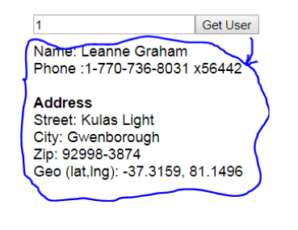
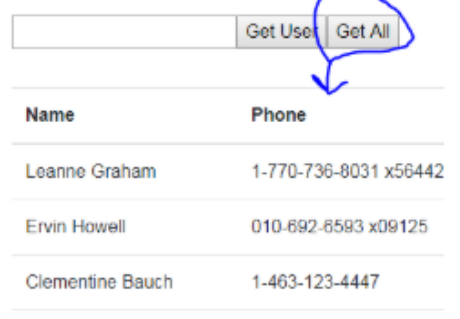

# Dynamic UI manipulation using data obtained via fetch

**This as a small, very first “getting started” tutorial, on how to use the fetch-API to fetch data.**

1. Enter this URL in a browser and observe the result:

```TEXT
https://jsonplaceholder.typicode.com/users/1
```

2. Change the number at the end of the URL to any number <= 10 and observe the result
3. Implement a page, as sketched in this figure, which should fetch the requested user, and render his data.

<figure>

</figure>

4. Enter this URL in a browser and observe the result:

```TEXT
https://jsonplaceholder.typicode.com/users
```

5. Use this URL and add a new button to the page as sketched in this figure. When pressed, it should fetch all persons and render name and phone in a table.

<figure>

</figure>

### Hints

Communication with a REST/JSON-based backend, is what we will do, almost on a daily basis for the rest of the semester.

For the first part you need to create the URL like this:

- ```JS
  let url = "https://jsonplaceholder.typicode.com/users/" + ID-FROM-INPUT
  ```
- For the second part, there are no arguments, so you just use this url each time “Get All” is pressed:

  ```JS
  const url = https://jsonplaceholder.typicode.com/users
  ```

- This is how you fetch the data (using the url variable declared above).
  ```JS
  fetch(url)
    .then(res => res.json())
    .then(data => {
     // Inside this callback, AND ONLY HERE the response data is available
     console.log("data",data);
    /* data now contains the response*/
  })
  ```
