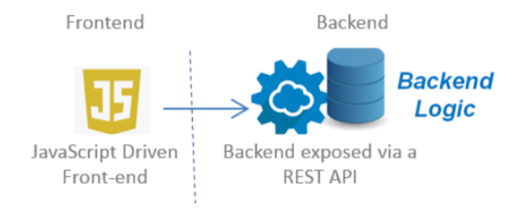

# Deploying Single Page Applications

Let's take a quick look at the architecture of the Single Page Application we are building this semester. The backend contains our application logic, and the (MySQL) database, with some functionality exposed via a REST API. The frontend is our javascript application (from period-3, written with React) which contains only static assets like HTML, CSS, JavaScript, images etc. The two applications only communicate via REST and do in no way have to be deployed to the same server.

</br>

Actually, there are several reasons for not doing that. Containing only static assets, the frontend calls for a system that can do caching, and only requires a simple file (WEB) server. The backend must handle all the domain logic, Java, database communication and usually, requires a more dedicated server. This is sketched in the figure below.

</br>

<figure>

</figure>

</br>

In this document, we will introduce you to host your SPA and its backend.

-  The static files will be hosted on your existing droplet by Nginx, not Tomcat, and the backend by Tomcat, as usual.

</br>

The strategiy will require Tomcat and probably a database, so let's first prepare the backend project for deployment

## Backend

This requires a backend setup as explained in our other guides. For the first strategy, you don’t have to change anything, apart from setting up CORS. For strategy two, you will need to change a few things, but start with a working project setup as in period 1.

## How to set the CORS headers in your Java backend

One thing you will have to do if you host your backend and frontend on different servers (Green Strategy in the following) is to set up CORS. You can set the required headers for each individual REST-endpoint, but for a large REST-API that would be cumbersome.

JAX-RS provides a concept Filters which can be used when you want to modify any request or response parameters like the headers.
In our case, we can use it to set the required CORS headers on all requests.

Somewhere in your Java-project, create a package cors and add the following filter-class to this package. You don’t need to do anything else. If the class is annotated with the @provider annotation, it will be picked up and activated by “magic” ;-)

- [Reference link](https://stackoverflow.com/questions/28065963/how-to-handle-cors-using-jax-rs-with-jersey)

```JAVA
import java.io.IOException;
import javax.ws.rs.container.ContainerRequestContext;
import javax.ws.rs.container.ContainerResponseFilter;
import javax.ws.rs.container.ContainerRequestFilter;
import javax.ws.rs.container.ContainerResponseContext;
import javax.ws.rs.container.PreMatching;
import javax.ws.rs.core.Response;
import javax.ws.rs.ext.Provider;

@Provider
@PreMatching
public class CorsFilter implements ContainerRequestFilter, ContainerResponseFilter {

  @Override
  public void filter(ContainerRequestContext request) throws IOException {

   //If it's a preflight request, abort the request with a 200 status, and the CORS headers are added in the
   // response filter method below.
   if (isPreflightRequest(request)) {
     request.abortWith(Response.ok().build());
      return;
    }
  }

  // A preflight request is an OPTIONS request with an Origin header.
  private static boolean isPreflightRequest(ContainerRequestContext request) {
      return request.getHeaderString("Origin") != null  && request.getMethod().equalsIgnoreCase("OPTIONS");
  }

  // Method for ContainerResponseFilter.
  @Override
  public void filter(ContainerRequestContext request, ContainerResponseContext response)
          throws IOException {
    // if there is no Origin header, then it is not a cross origin request - don't do anything.
    if (request.getHeaderString("Origin") == null) {
          return;
    }

    // If it is a preflight request add all the CORS headers here.
    if (isPreflightRequest(request)) {
        response.getHeaders().add("Access-Control-Allow-Credentials", "true");
        response.getHeaders().add("Access-Control-Allow-Methods","GET, POST, PUT, DELETE, OPTIONS, HEAD");
          response.getHeaders().add("Access-Control-Allow-Headers",
          // Whatever other non-standard/safe headers (see list above)
          // you want the client to be able to send to the server,
          // put it in this list. And remove the ones you don't want.
          "Origin, Accept, Content-Type, Authorization,x-access-token");
    }

    /* Cross origin requests can be either simple requests or preflight request. We need to add this
     header to both types of requests. Only preflight requests need the previously added headers. */
     response.getHeaders().add("Access-Control-Allow-Origin", "*");
  }
}
```

Turning the CORS headers off if you don’t need CORS, either because you have deployed on Nginx (Same-origin), or because you temporarily want to see the effect of not having the CORS-headers, just comment out the @Provider annotation and the filter will never come into play.

## Changes to your client, necessary for both strategies

1. Make sure your backend is running on your droplet, and copy the URL used for the welcome page (which you eventually should remove) into the clipboard.

If not already in your front-end project, add a file constants.js, and add the the code below to this file:

```JS
const SERVER_URL = "THE URL COPIED IN STEP 1"
export {SERVER_URL};
```

IMPORTANT: Now anywhere in your client-side code where you need a reference to the backend make sure to get the URL from this file like this:

```JS
import {SERVER_URL} from './constants.js'
```
