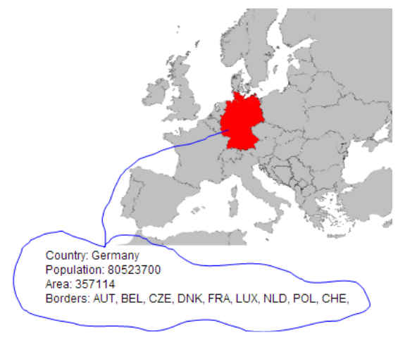

## Europe map exercise

Start with cloning the project

```TEXT
git clone -b europemap https://github.com/CPH-Business-Academy/3sem_javascript_exercises.git
``` 

In this exercise, we will combine SVG with several of the topics we have been around this semester such as AJAX and REST-endpoints to obtain data, and Javascript for DOM-manipulation.

The task is to create a web-page with a map of Europe which, when a country is selected with a mouse click, should highlight the country and print details about the country as sketched below.

1. In your terminal write **npm install**
2. Then **npm run dev**

This is an SVG image where each country is given the ISO-country code as the id. This is very convenient, because using the public REST API given here: http://restcountries.com/v3.1/alpha/de you will obtain a JSON encapsulated data package with all the information needed to fill out the details (just test the link above in a Browser).

You find the SVG code in the **index.html** file.

</br>

<figure>
    
    <!-- <figcaption><em>Cars Table</em></figcaption> -->
</figure>

</br>

3. Hook up an event handler on the map, get the id, perform an AJAX request to fetch the JSON-data from the link given above, and update the GUI using the JSON data to view the data as sketched above.

4. Change the color of the selected country by changing its fill property.

Hint:

Hook up a click-handler on the overall svg map (id=outer), and in that, find the id for the actual element that was clicked (country code) via the target property of the event handler.
